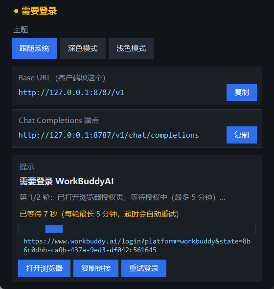
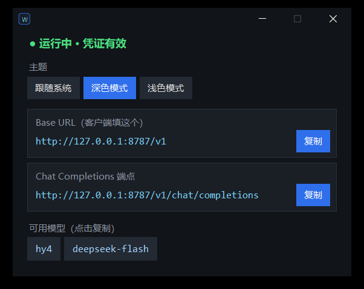
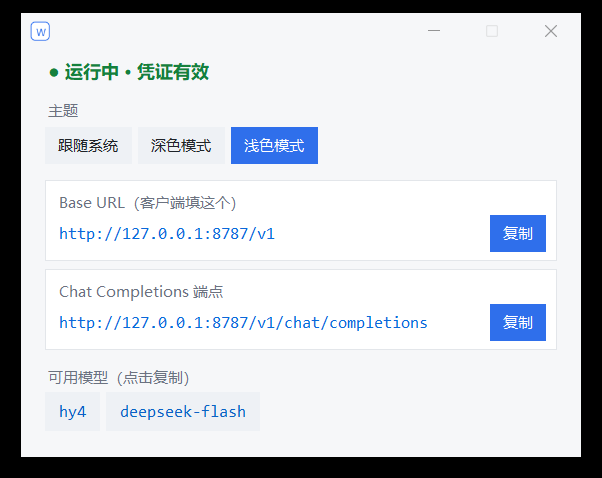

# workbuddyai-gateway-py

WorkBuddyAI 的本地 OpenAI Chat Completion 透明代理网关（Python 版）。

将任何兼容 OpenAI Chat Completion API 的客户端请求，透明转发到 WorkBuddyAI 后端。

## 特性

- **纯代理**：不修改请求/响应，只添加认证头（唯一的例外见「模型短名映射」）
- **OpenAI 兼容**：提供 `/v1/chat/completions` 和 `/v1/models` 端点
- **一体式启动**：自动检查登录状态，失效自动刷新，必要时触发浏览器登录
- **端口自愈**：默认端口被自身残留实例占用时自动接管，第三方进程需确认
- **SSE 平滑转发**：逐行 Flush，思考流不再碎片化

## 界面

托盘常驻 + 原生窗口栏状态窗口，深/浅色两套主题（跟随系统 / 深色模式 / 浅色模式，
窗口栏与标题栏图标一并跟随）。

未登录或凭据失效时，窗口会直接进入「需要登录」状态：显示授权链接、提供
`打开浏览器` / `复制链接` / `重试登录`，并给出等待进度与已等待时长，
登录成功后自动启动网关；启动失败（如端口被占用）也会在窗口里给出原因与
重试入口——无需查看控制台。



| 深色模式 | 浅色模式 |
| --- | --- |
|  |  |

## 快速开始

双击 `dist/workbuddyai-gateway-<版本号>.exe`，或源码运行：

```bash
uv sync
uv run python src/__main__.py    # 一体式启动：无凭证自动登录，有凭证直接启动网关
```

可选参数：`--addr`（监听地址，默认 `127.0.0.1:8787`）、`--verbose`、`--force-login`（强制重新登录）。

## 打包

使用 PyInstaller（onefile），构建配置在 `workbuddyai-gateway.spec`
（产物名 = 项目名-版本号，版本号取自 `src/cli.py` 的 `__version__`；含 models.json 数据文件、无控制台、关闭 UPX）：

```bash
uv run pyinstaller workbuddyai-gateway.spec --noconfirm
# 产物 dist/workbuddyai-gateway-<版本号>.exe（如 workbuddyai-gateway-0.1.0.exe）
```

## 模型短名映射

- 网关对外暴露短名：**`hy4`**、**`deepseek-flash`**（`/v1/models`、客户端配置、界面均用短名）
- 内部转发时映射回上游 slug：`hy4 → hy4-preview-f`、`deepseek-flash → deepseek-v4.1-flash`
- 映射关系由项目根目录 `models.json` 校验（缺失时用内置默认）；未识别的模型名原样透传

## 存储

凭证保存在 `~/.workbuddyai-gateway/credentials.json`（权限 0600），不要提交到 git。

## 注意

- WorkBuddyAI 后端只支持 streaming 响应，且首条 message 必须是 system
- 可用模型（对外短名）：`hy4`、`deepseek-flash`
- 网关默认地址：`http://127.0.0.1:8787`
